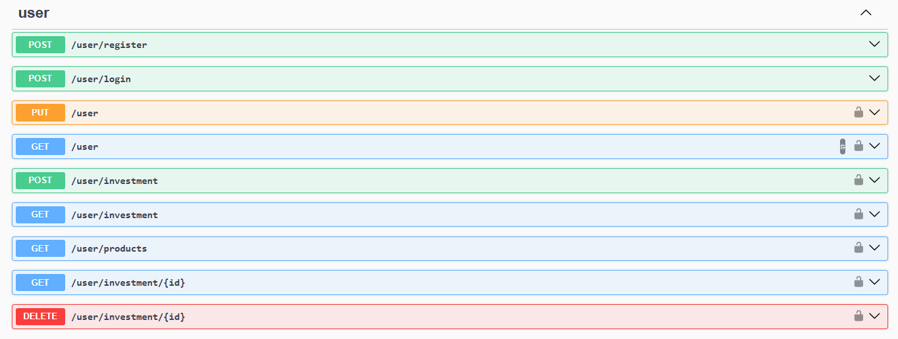

# Better Money Invest API

## Overview

This API aims to simulate a simple investment brokerage system. I created this API to learn NestJS and practice my TypeScript knowledge. The first version of this project is under development.

The primary challenges I've encountered so far relate to user and admin authentication/authorization, as security is paramount in this type of system. Another challenge has been modularizing the application, which required significant effort to distribute responsibilities sensibly across each service and module.

To resume a little this project, we have five modules: admin (broker system admin operations), auth (auth and autorization logic), database (operations in database, typeorm configuration and in the development, the sqlite db file), products (all the investment products and the logic to interact with them) and user (broker users operations). 

To date, I've learned about NestJS's CRUD operations, security features, and TypeORM integration.

## Contents Table
* [Tools](#tools)
* [Architecture](#architecture)
* [Features](#features)
* [Swagger documentation](#swagger-documentation)
* [Prerequisites](#prerequisites)
* [Instructions](#instructions)

## Tools

In this project, i used NestJS (framework of NodeJS), TypeORM to ORM operations with database, SQLite in the development (It isn't going to be the deployment database), JWT token as the identifier of the user/admin after authentication and TypeScript, bcrypt to hash the passwords before going to database and TypeScript language.

## Architecture

The API architecture can be described in 5 key points:

### 1º Modular Structure:

We have six modules organized into admin, auth, database, logger, products and user.

Admin: Handles administrative functionality, including services, controllers, entities, and DTOs. It interacts with the auth, database, and products modules.

Auth: Implements authentication and authorization logic, providing services, guards, and decorators. It is utilized by the admin and user modules.

Database: Manages database operations and TypeORM configuration. It serves as a central point of interaction for the admin, user, products, and logger modules.

Logger: Provides logging functionality using Winston and interacts with the database module for log persistence.

Products: Handles investment product information and related logic, including services, entities, and DTOs. It is accessed by the admin and user modules.

User: Manages user-related functionality, encompassing services, controllers, entities, DTOs, and an investment service used within the user controller. It interacts with the auth, database, and products modules.

The benefits of this approach are improvement of the code maintanability, reusability and separation of concerns.

### 2º Dependency Injection:

Dependency injection is a design pattern that basically promotes a loose coupling between components by the injection of dependencies outside the class, so a class that uses another class is not going to instanciate an object inside her, but through her constructor. The NestJS leverages this concept by providing a built-in Dependency Injection container, and the dependencies already instantiated are going to be reused when needed, improving the code performance of the application.

As a short example, the admin controller uses the admin service as a dependency, so in the admin controller we declare private adminService: AdminService saying to NestJS that this controller needs an instantiation of the admin service.

This approach advantages are improved testability of the code, loose coupling between components and reusabiity.

### 3º Data Access Layer (TypeORM):

TypeORM is an Object-Relational Mapper (ORM) that simplifies database interactions in Node.js applications, allowing you to work with data using object-oriented paradigms instead of raw SQL queries. It supports both JavaScript and TypeScript, making it a great fit for this project.

Entities were designed to encapsulate only the essential data required for each model, promoting efficiency and maintainability. As an example, the investments entity in the user module were defined with the needed propertys like number of assets, the user related to and the product retrieved from product database, so with this data, the operations with them could be done.

The NestJS supports the repository design pattern, that allow each entity has its own repository. So, each entity has its own repository in the dabatase, then we have some repositories like products, user, investments, etc. The entities were defined in a .entity.ts file, where all of them got a primary generated column (@@PrimaryGeneratedColumn()), that represents a unique ID in the repository, columns (@Column()) and some of them got relationships like many-to-one(@ManyToOne("definition of the relationship")).The Investment entity utilizes relationships to establish connections with the User and Product entities, reflecting the real-world associations between these concepts.

### 4º API Endpoints & Controllers:

This API followed some of the RESTful principles for designing endpoints and handling HTTP requests, they are client-server architecture, statelessness, layered system and uniform interface. For a comprehensive understanding of RESTful principles, refer to this article: https://aws.amazon.com/what-is/restful-api/?nc1=h_ls. 

Controllers act as the interface between the client and the application, handling incoming requests and delegating data processing and business logic to dedicated services. The NestJS provides methods decorators for each CRUD operator and their parameters defines resources, so become more simply to define the application endpoints and the class for the controller is defined with a class decorator @Controller(param) where param define the main route for the controller where the resources rely on.

### 5º Authentication & Authorization:

User and admin passwords are hashed using the bcrypt function before being stored in the database. This crucial security measure protects against unauthorized access even if the database is compromised. Bcrypt is a computationally expensive hashing algorithm, making it challenging for attackers to crack passwords through brute-force methods.

JWTs are used for both authentication and authorization in this API. A JWT is a digitally signed token that securely transmits information between parties. Upon successful login, a JWT is generated, containing the user's or admin's identification and role. This token is then included in subsequent requests to protected endpoints.

The API verifies the JWT's signature and extracts the payload to authenticate the user/admin and authorize their access to specific resources. The user's role, included in the JWT payload, enables role-based access control, restricting access to certain endpoints or functionalities based on their assigned role

For JWT validation and verification of role, the guard from the NestJS were used. A guard is a class with single responsibility that determine wheter a given request will be handled by the route handle or not, depending on certain conditions present in run-time. So basically, the guard implemented in this project would check if the JWT was expired or with some error, and he check the role making the comparation with the role annotated on the route handle

### 6º Additional Considerations:

For error handling were used try catch mechanism and most of them were centralized in database service, because operations on database are more likely to produce errors, and some errors will be cared by the API consumer. 

Also, for critical errors, error logging were implemented using Winston library to be used in production enviroment.

## Features

**User Management:**

* Secure user registration and login with JWT authentication.
* Ability for users to manage their account information.
* Secure handling of sensitive user data.

**Investment Portfolio Management:**

* Users can view their investment portfolio.
* Ability to buy and sell various investment products.
* View detailed information about each investment product.

**Admin Functionality:**

* Secure admin login with restricted access.
* Manage client information (view, update).
* Add and update investment products in the system.

**Data Management:**

* Utilizes TypeORM for efficient and type-safe database interactions.
* Implements entity relationships to maintain data integrity.
* Clear separation of concerns between data access and business logic.

**API Design:**

* Leverages RESTful principles for clear and organized endpoints.
* Uses NestJS decorators for streamlined routing and controller definitions.
* Returns data in JSON format for easy consumption by clients.

**Additional Features:**

* **Error Handling:** Centralized error handling for database operations and use of Winston for critical error logging.
* **Logging:** Detailed logging of user actions and system events for auditing and troubleshooting purposes.

## Swagger documentation

You can access the basic Swagger documentation by navigating to http://localhost:3000/swagger after starting the project. There, all the endpoints of the API are shown and divided into admin and user (client) sections. Additionally, there is an input field for the JWT token generated after logging in as an admin or user. The DTOs required for some endpoints are also described after the endpoints description.  

## Instructions

To run the API:

Clone this repository\
Execute npm install in the terminal to install the project dependecies\
Create a .env file in the root of the folder project and assing a value to SECRET = "secret for the jwt token"\
Run npm run start to start the project

## Prerequisites

* Node.js (version 16 or higher)
* npm (usually installed with Node.js)
